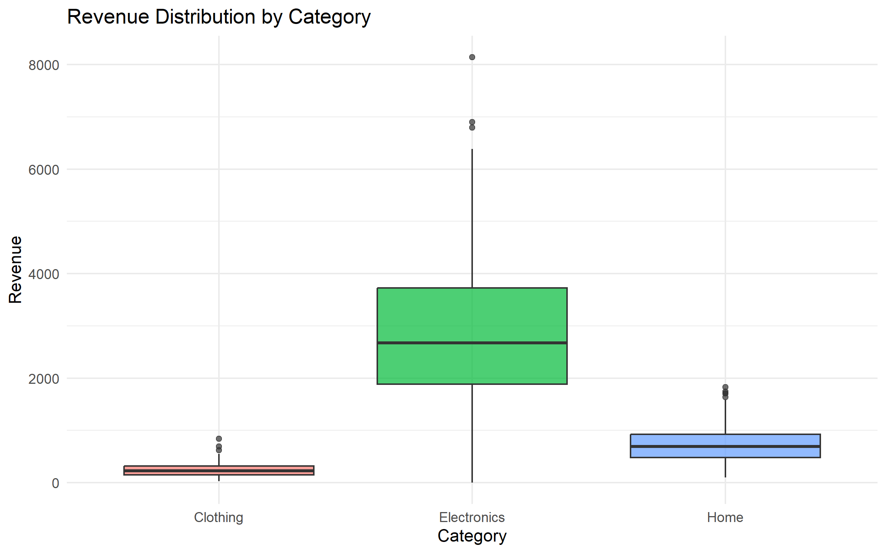
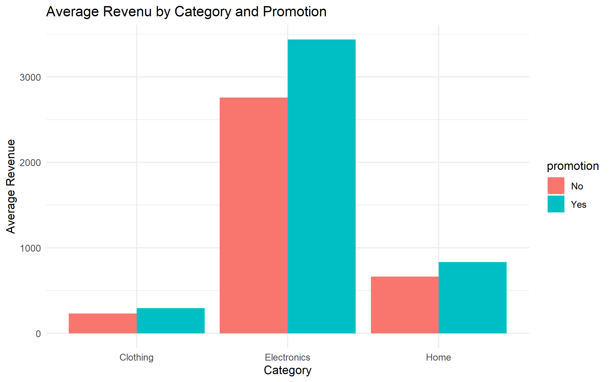
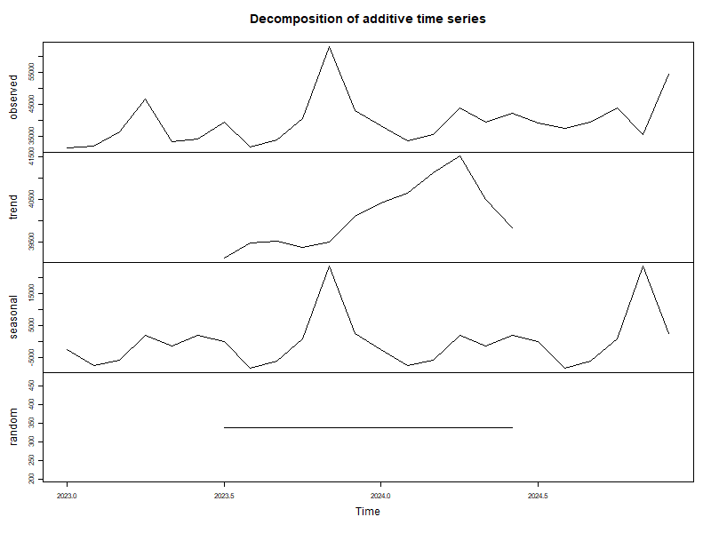
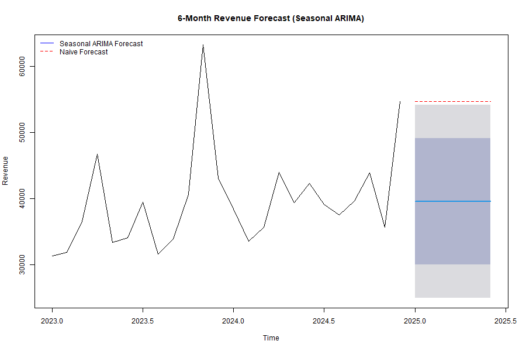

# 📊 My Journey To The Mountain Of Data Science Through R


> *"The best way to learn data science is to do data science."*

This repository documents my personal journey learning **R** — from my very first `print()` statement to building full end-to-end data science pipelines with real statistical models. Every file, comment, and confusion is preserved as proof of the learning process.

---

## 🗺️ Projects Overview

| # | Project | Topics Covered | Status |
|---|---------|---------------|--------|
| 1 | [Network Traffic Analysis](#1️⃣-network-traffic-analysis--visualization) | Data generation, ggplot2, leaflet maps | ✅ Complete |
| 2 | [**Sales Data Analysis & Forecasting**](#2️⃣-sales-data-analysis--forecasting-) | Full pipeline: EDA → Seasonality → Promotion Analysis → ARIMA Forecasting | ✅ Complete |

---

## 2️⃣ Sales Data Analysis & Forecasting ⭐

> **Main Project** — A complete data science pipeline from synthetic data generation to time series forecasting.

This project simulates 2 years of retail sales data across multiple product categories, regions, and sales channels — then runs a full analytical pipeline on top of it.

### 📂 Project Structure

```
Sales_Data/
├── data/
│   └── sales_data.csv              ← 730 rows of synthetic sales data
├── outputs/figures/
│   ├── monthly_revenue_trend.png
│   ├── promotion_category_revenue.png
│   ├── decomposition.png
│   └── revenue_forecast.png
├── data_generation.r               ← Step 1: Build the dataset
├── eda.r                           ← Step 2: Explore it
├── promotion_analysis.R            ← Step 3: Promotion impact
├── sesonality.r                    ← Step 4: Decompose seasonality
└── forecasting.r                   ← Step 5: Forecast next 6 months
```

---

### 🔧 Step 1 — Data Generation (`data_generation.r`)

Generates 730 days (2 years) of realistic sales records — with actual business logic baked in:

- 📦 **12 products** across 3 categories: Electronics, Clothing, Home
- 🗓️ **Seasonal boost** — November & December sales increased by 40% (holiday season)
- 📅 **Weekend boost** — Saturday & Sunday get 20% higher quantities
- 🏷️ **Promotions** — 25% chance each day; promotions raise quantity by 50% but discount price by 15%
- 🌍 **4 regions**, 2 sales channels (Online / Store)

**Key R concepts used:**
- `set.seed()` for reproducibility
- `rpois()` for Poisson-distributed random quantities
- `lapply()` + `do.call(rbind, ...)` to build a dataframe row by row
- `paste0()` for string concatenation without spaces

---

### 📊 Step 2 — Exploratory Data Analysis (`eda.r`)

**Monthly Revenue Trend:**



The monthly revenue trend shows the aggregated pipeline working correctly — clear seasonal patterns are visible in the data with revenue peaking toward year-end.

**Key R concepts used:**
- `%>%` (pipe operator) — chain operations like SQL subqueries
- `floor_date()` from `lubridate` — round dates down to month
- `group_by()` + `summarise()` — equivalent to SQL `GROUP BY`
- `geom_line()` + `geom_point()` — layered ggplot2 grammar
- `as.Date()` — converts CSV text strings into real Date objects R can compute with

---

### 🏷️ Step 3 — Promotion Impact Analysis (`promotion_analysis.R`)

Does running a promotion actually increase revenue per order?



This grouped bar chart breaks down average revenue by **category × promotion status** — revealing whether the discount-driven volume gain outweighs the lower unit price.

**Key R concepts used:**
- `group_by(category, promotion)` — multi-key grouping
- `geom_bar(stat = "identity", position = "dodge")` — side-by-side bars
- `.groups = "drop"` — cleans up grouping metadata after `summarise()`
- `n()` — count rows in a group (like SQL `COUNT(*)`)

---

### 🌊 Step 4 — Seasonality Decomposition (`sesonality.r`)

Breaking the time series into its fundamental components:



The `decompose()` function splits the monthly revenue signal into:

| Component | What It Means |
|-----------|---------------|
| **Observed** | The raw data |
| **Trend** | The long-term direction (growing? declining?) |
| **Seasonal** | The repeating yearly cycle (holiday peaks) |
| **Random** | Unexplained noise after removing trend + seasonality |

Using `type = "additive"` because the seasonal swings stay roughly the same size regardless of the overall revenue level.

**Key R concepts used:**
- `ts()` — convert a vector into a time series object with frequency and start date
- `decompose()` — classical seasonal decomposition by moving averages
- `frequency = 12` — tells R the seasonal period is 12 months (1 year)

---

### 🔮 Step 5 — 6-Month Revenue Forecast (`forecasting.r`)

The final step: predicting the next 6 months using a Seasonal ARIMA model.



Two models are compared:

| Model | Description |
|-------|-------------|
| **Seasonal ARIMA** *(blue)* | Auto-selected model capturing trend, autocorrelation, and seasonality |
| **Naïve Forecast** *(red dashed)* | Baseline — "next month = last month" |

The shaded blue bands are **80% and 95% confidence intervals** — showing the range of uncertainty in the forecast.

**Key R concepts used:**
- `auto.arima(seasonal = TRUE)` — automatically tests hundreds of ARIMA configurations and picks the best
- `naive(h = 6)` — baseline model to beat
- `forecast(model, h = 6)` — generate predictions n steps ahead
- `checkresiduals()` — diagnose model quality (residuals should look like random noise)
- `legend()` with `lty`, `col`, `bty` — customizing plot legends

---

### ▶️ How to Run

```bash
# Navigate into the Sales_Data folder first (paths are relative)
cd Sales_Data

# Run in pipeline order:
Rscript data_generation.r   # Creates data/sales_data.csv
Rscript eda.r               # EDA plots
Rscript promotion_analysis.R
Rscript sesonality.r
Rscript forecasting.r       # Final forecast
```

**Required packages:**
```r
install.packages(c("dplyr", "lubridate", "ggplot2", "forecast"))
```

---

## 1️⃣ Network Traffic Analysis & Visualization

**Description:** My first real R project. Simulates 1,000 network traffic events with timestamps, source/destination IPs, and bytes transferred — then visualizes them.

**Visualizations produced:**
- 📈 Line chart: traffic volume over time
- 📊 Bar chart: top 10 source IPs by bytes transferred
- 🗺️ Interactive Leaflet map: global traffic flows saved as `network_traffic_map.html`

**Key concepts learned:**
- `seq.POSIXt()` for datetime sequences
- Custom functions (`generate_ipv4`)
- `aggregate()` for groupby operations
- `leaflet` for interactive HTML maps
- `%>%` pipe operator (first encounter)

---

## 📈 My R Learning Progression

```
Week 1:  Variables, types, basic syntax (FirstFile.r)
         └── set.seed(), data.frame(), sample(), paste()

Week 2:  First project — Network Traffic Analysis
         └── Functions, ggplot2, leaflet, aggregate()

Week 3+: Sales Data Pipeline
         └── dplyr, lubridate, time series, ARIMA forecasting
```

---

## 🛠️ Tools & Libraries

| Library | Purpose |
|---------|---------|
| `ggplot2` | All static visualizations |
| `dplyr` | Data wrangling (filter, group, summarise) |
| `lubridate` | Date manipulation (floor_date, year, month) |
| `forecast` | ARIMA modelling and forecasting |
| `leaflet` | Interactive HTML maps |

---

## 🔮 What's Next

- [ ] Add regional sales breakdown (heatmap by region)
- [ ] Statistical test: is the promotion uplift actually significant? (`t.test`)
- [ ] Customer-level analysis — repeat buyers, LTV estimation
- [ ] Build a `shiny` dashboard for interactive exploration
- [ ] Use `dplyr` instead of base `aggregate()` in the network project

---

## ⚠️ Disclaimer

All datasets are **synthetically generated**. No real customer, network, or business data is used anywhere in this repository.

---

## 📌 License

This project is licensed under the **MIT License**.
